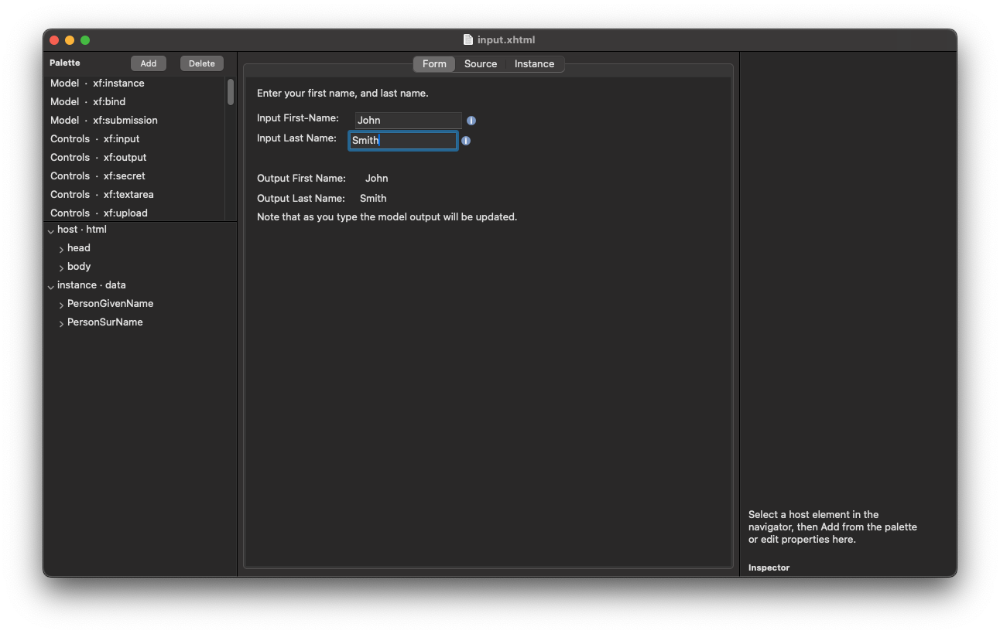
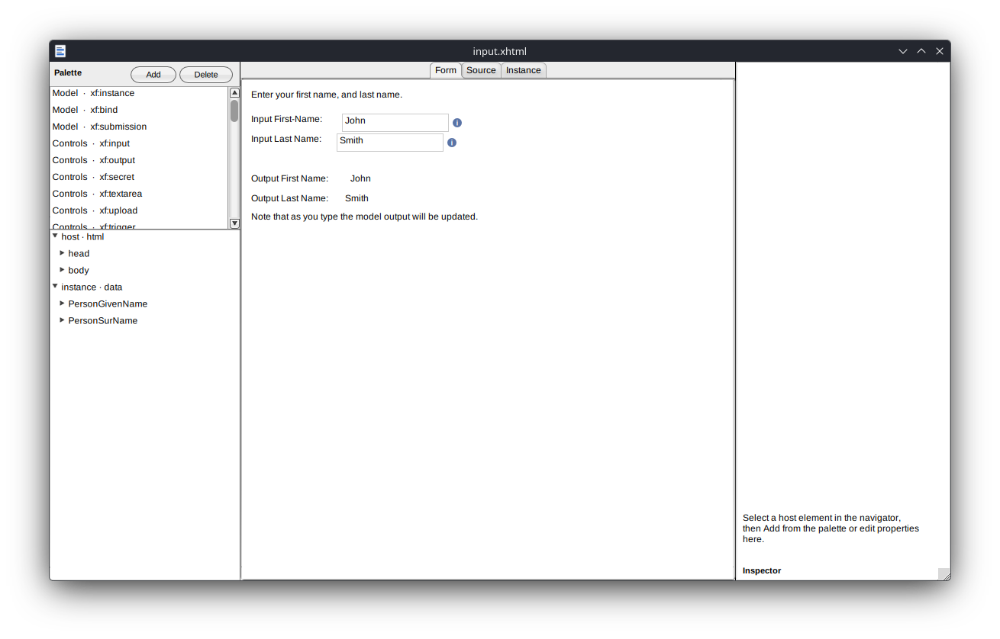
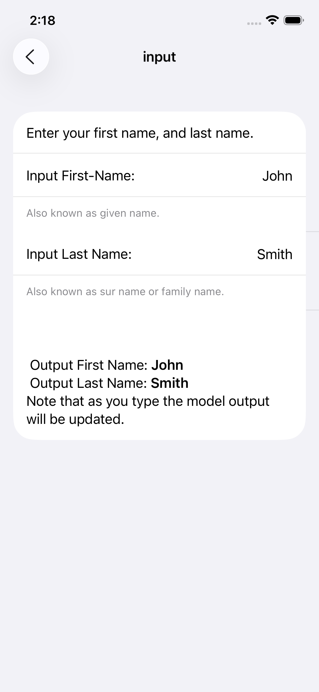
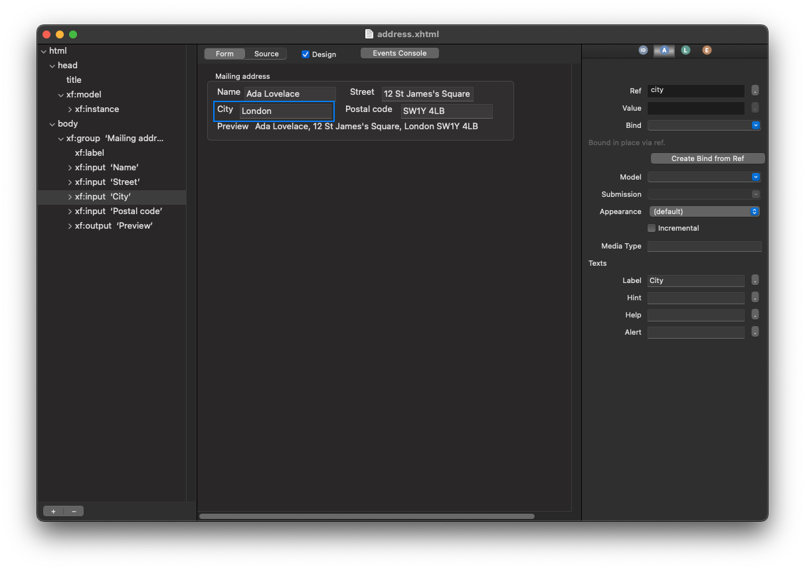
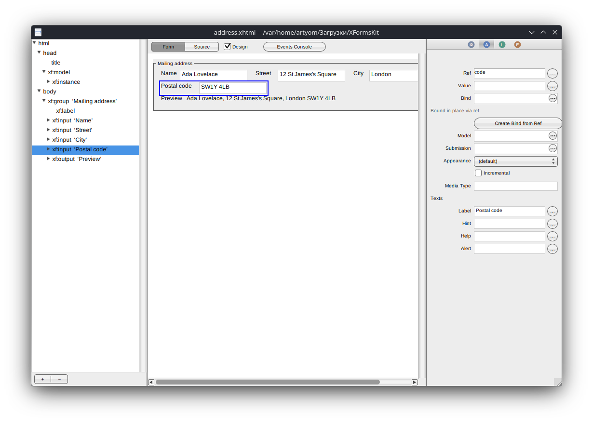
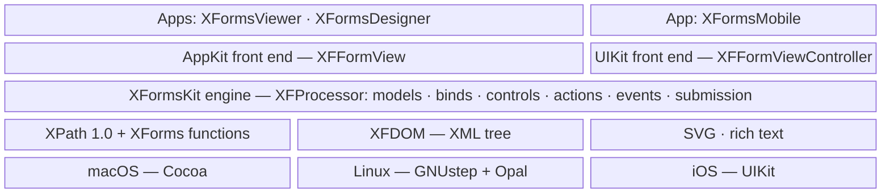
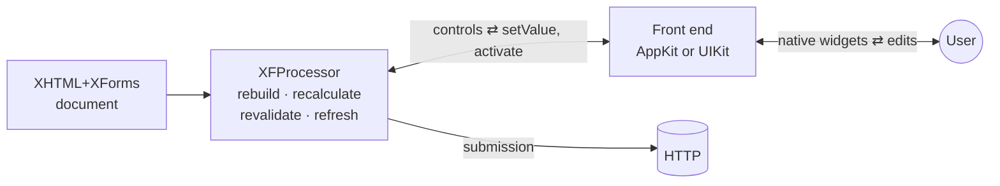

# XFormsKit

A native **XForms 1.1** engine in Objective-C, for **macOS, iOS and Linux (GNUstep)**.
It reads an XHTML+XForms document and runs it as a real native form: stock
widgets, no web view, no JavaScript. The engine is a translation of
[XSLTForms](https://github.com/AlainCouthures/xsltforms); on top of it
sit two native front ends and three apps — a viewer, a form designer and an iOS
host.

| macOS | Linux (GNUstep) | iOS |
|:---:|:---:|:---:|
|  |  |  |
|  |  | |

## Get it

Download from [Releases](https://github.com/ashalkhakov/XFormsKit/releases/latest):

| Platform | Download | Contains |
|---|---|---|
| macOS 11+ (designer 12+) | `XFormsViewer-macOS-*.zip`, `XFormsDesigner-macOS-*.zip` | Signed, notarized apps |
| Linux x86_64 | `XFormsKit-Linux-*.AppImage` | Viewer + designer; opens a chooser (`… designer`, `… form.xhtml` go straight in) |
| iOS 15+ | — | Build `XFormsMobile` from source |

Every push also uploads unsigned builds to its [Actions run](https://github.com/ashalkhakov/XFormsKit/actions).

Build from source:

    # macOS / iOS
    xcodebuild -project XFormsKit.xcodeproj -scheme XFormsViewer build
    # Linux, with a GNUstep prefix (see docs/building.md)
    make && make apps

Details: [docs/building.md](docs/building.md) · [docs/packaging.md](docs/packaging.md).

## What works

- **XForms 1.1 core** — models, instances (inline and `@src`), `xf:bind` with
  calculate / relevant / readonly / required / constraint / type, XPath 1.0 plus
  the XForms function library, XML Events, the action set (`setvalue`, `insert`,
  `delete`, `toggle`, `dispatch`, `message`, `load`, `send`, `if` / `while` /
  `iterate`), submission (XML, urlencoded, multipart, JSON/CSV; replace
  all / instance / text), repeats, groups, switch, dialogs.
- **Every control** — input, secret, textarea, output, select / select1 (all
  appearances, itemsets), range, upload, trigger, submit; date and time inputs.
- **Conformance** — all 458 W3C XForms 1.1 test cases pass, on macOS, iOS and
  GNUstep, in CI.
- **Real forms** — the 47 XSLTForms sample forms in [`Samples/`](Samples) open
  and run, including SVG charts with live values, rich-text hints and host
  tables of controls.
- **Designer** — outline, palette, inspectors, XPath editor with highlighting,
  event console and submission tester, on macOS and GNUstep.

## Limitations

- **No JavaScript.** A form that calls functions from a `<script>` needs them
  registered natively (`+[XFXPath registerHostFunctionNamed:evaluator:]`).
- **No form server.** The apps open documents from disk; submission works, but
  there is nothing to serve or store forms yet.
- **GNUstep:** dates display but cannot be edited until gnustep-gui gets an
  editable `NSDatePicker` ([#22](https://github.com/ashalkhakov/XFormsKit/issues/22)).
  The Linux build ships a patched gnustep-gui
  ([`patches/gnustep`](patches/gnustep), upstreaming in
  [#23](https://github.com/ashalkhakov/XFormsKit/issues/23)).
- **iOS:** one control per row in the iOS idiom, not the desktop layout; no
  designer; no App Store or TestFlight build.
- **Not implemented:** XSLTForms extensions `ajx:tabs`, `xf:tree`,
  `appearance="table"` on groups and repeats; Android
  ([#11](https://github.com/ashalkhakov/XFormsKit/issues/11)).

## Architecture

One portable engine, two front ends, three platforms.

Each layer uses only the one below, and a column is a platform: the AppKit front
end is one code base for macOS and GNUstep. The engine is identical everywhere,
and the front ends hold no form logic — they render what the processor exposes
and hand edits back. `XFormsLauncher` (not shown) only picks an app inside the
AppImage.

| Path | What |
|---|---|
| `Sources/XFormsKit/` | Engine: processor, model, controls, actions, events, submission |
| `Sources/XFormsKit/XPath/` · `DOM/` · `SVG/` · `RichText/` | Portable subsystems |
| `Sources/XFormsKit/AppKit/` · `UIKit/` | The two front ends |
| `Apps/` | Viewer, designer, iOS app, AppImage launcher |
| `Tests/` · `TestSuite/` | Unit tests, W3C conformance suite |
| `Samples/` | XSLTForms sample forms |
| `docs/` | Design notes, XSLTForms mapping and gap list |

## Documentation

- [Building](docs/building.md) and [packaging](docs/packaging.md)
- [XSLTForms → XFormsKit class map](docs/XSLTForms-mapping.md) and [gap list](docs/XSLTForms-gaps.md)
- [iOS port plan](docs/ios-port-plan.md) · [W3C suite as XCTests](docs/w3c-xctests.md) · [Submission authentication](docs/submission-auth.md)
- [GNUstep notes and patches](patches/gnustep/README.md)

## License

[LGPL 2.1](COPYING.LIB).
